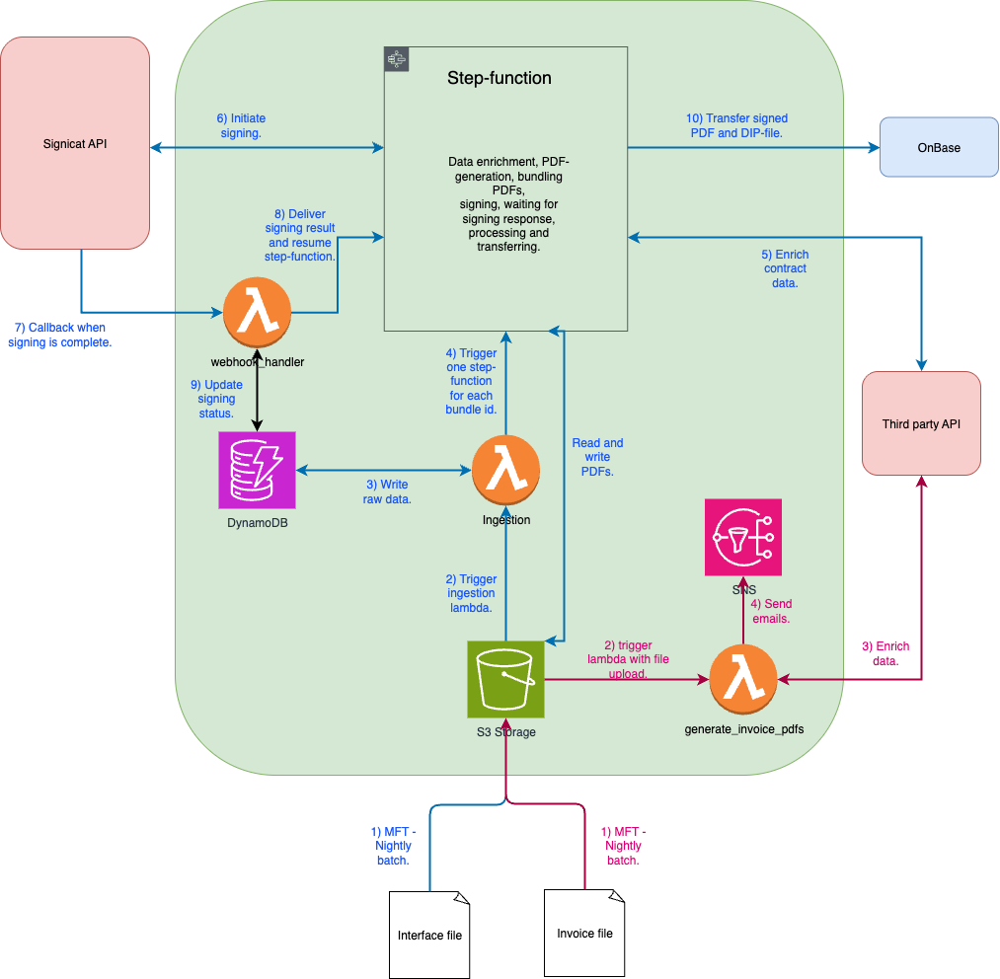

# 1. Overview

Build a serverless AWS solution that (a) creates one contract PDF per vehicle from the nightly NSC interface file, supporting single-page and **bundled** multi-page PDFs with duplicate protection; (b) initiates and tracks e-signing via **Signicat** to the authorized dealer signee; (c) enforces a **visible e-signature stamp on all pages**; and (d) delivers the **signed PDF + signing log/ID + one DIP per vehicle to OnBase** (for bundles, the same file is referenced per vehicle). Additionally, generate and email an **SF “momsfaktura” PDF** from invoice XML to the dealer and SF mailboxes.

---

# 2. System Architecture

Serverless, event-driven. **Ingestion stays thin**; long-lived orchestration runs in a single **AWS Step Functions (Standard)** execution per bundle:

**Initialize Bundle → Process Vehicles (Map) → Assemble Bundle PDF → Create Signing Session (Task Token) → Deliver to OnBase (Map).

Unsigned PDFS are written temporarily to S3. The invoice path runs in parallel (Figure 1).


Figure 1. Architecture overview.

## 2.1 Platform Components

* **Amazon S3 (Inbound)**

  * `inbound/interface/` — nightly NSC interface files (contracts)
  * `inbound/invoice/` — invoice XML for the momsfaktura flow
* **AWS Lambda — Ingest**

  * Trigger: S3 `Put` on interface files
  * Parse & validate rows
  * **Idempotent** writes to DynamoDB using conditional puts
  * Derive `bundle_id`; **start one Step Functions execution per bundle** with `{ bundle_id }`
* **Amazon DynamoDB (single table, minimal)**

  * **Partition key:** `bundle_id`
  * **Sort key:** `sk` (typed value, e.g., `HEADER#0`, `VEHICLE#<contract_id>`)
  * **`item_type`**: human-readable type (`"header"` or `"vehicle"`)
  * Timestamps: `created_at`, `updated_at`
* **AWS Step Functions (Standard)**
  Orchestrates all post-ingest stages (states listed below). How to distribute the code accross lambdas TBD.
* **Amazon API Gateway + Webhook Lambda**
  Receives Signicat callbacks at a **bundle-aware** endpoint, resumes the waiting Step Functions task (task token).
* **OnBase / DMS integration**
  Receives the **signed bundle** (single file), signing log/ID, and **one DIP per vehicle**.
* **Invoice Lambda**
  XML → PDF → email distribution (dealer + SF mailboxes).

## 2.2 Contract Processing Workflow (incl. Ingestion & Handoff)

**End-to-end flow:**

* **Step 0 (outside Step Functions):** S3-triggered **Ingest Lambda** parses the nightly file, writes records to DynamoDB **idempotently**, and **starts one Step Functions execution per bundle**.
* **Steps 1–6 (inside Step Functions):** The **per-bundle** state machine processes vehicles, assembles the bundle PDF, creates the signing session (task token + webhook), stamps, delivers to OnBase, and closes out.

### Step 0 — Ingest & Orchestration Handoff (outside SFN)

1. **Parse & validate** each row.
2. **Idempotent upsert** to DynamoDB using a conditional put on the real key:

   * Table `contracts`, partitioned by `bundle_id`
   * Vehicle item key: `PK=bundle_id`, `SK="VEHICLE#<contract_id>"`
   * Condition: `attribute_not_exists(sk)` to drop duplicates caused by retries
   * Ensure header: `PK=bundle_id`, `SK="HEADER#0"`, `status="NEW"`
3. **Start-once lock:** set `started_at` on the header with `attribute_not_exists(started_at)` to avoid double starts.
4. **Start SFN per bundle:** `StartExecution` with payload `{ "bundle_id": "<id>" }`. If the file contains multiple bundles, repeat for each.

**Output to SFN:**

```json
{ "bundle_id": "<id>" }
```

### Steps 1–6 — Per-bundle state machine (inside SFN)

NOTE: To be decided how to structure the lambdas inside the step function. Probably it makes sense to merge some of them into a bigger lambda depending on throughput criteria.

**1) Initialize Bundle (Lambda)**  
* Load header + vehicles for the bundle  
* Validate uniqueness and ordering  
* Persist a deterministic bundle manifest (`bundle_order.json`)  
* Emit references for artifacts, bundle prefix, and the vehicle list  

**2) Process Vehicles (Map)**  
_Per vehicle:_  
* Enrich data with lookups  
* Update vehicle status in DynamoDB  
* Render PDF pages and store short-lived artifacts    

**3) Assemble Bundle PDF (Lambda)**  
* Read the bundle manifest + per-vehicle page references  
* Concatenate all pages in memory into a single PDF  
* Write one unsigned bundle to storage   

**4) Create Signing Session (Task Token) (Lambda)**  
* Provide the unsigned bundle to Signicat (stream or pre-signed URL)  
* Store signing request info and task token on the bundle header  
* Wait for the webhook callback to resume execution  

**Webhook Callback (API GW + Lambda)**  
* Receive signing status for the bundle  
* Resolve the waiting task token to continue the workflow  

**5) Finalize signing**  
* Download signed PDF from Signicat   
* Write the final stamped PDF to permanent storage  
* Update bundle header

**6) Deliver to OnBase (Map)**  
_Per vehicle:_  
* Build a delivery package (DIP)  
* Deliver the same signed bundle + signing log/ID  
* Update per-vehicle status and record delivery receipts
* Set bundle status: `DELIVERED` or `PARTIAL_FAILED`

---

## 2.3 Data Model (DynamoDB) — Minimal

**Table:** `contracts` (single table)

**Primary keys**

* **PK:** `bundle_id`
* **SK:** `sk` (typed value: `HEADER#0`, `VEHICLE#<contract_id>`)

**Header item (minimal)**

```json
{
  "bundle_id": "2025-09-15-DEALER123",
  "sk": "HEADER#0",
  "item_type": "header",

  "status": "NEW",                       # NEW | READY | SENT | SIGNED | DELIVERED | PARTIAL_FAILED | FAILED
  "sign_request_id": null,               # set when signing session is created
  "wait_task_token": null,               # set before SFN wait; read by webhook
  "signed_uri": null,                    # set after Stamp/(Optional) Seal

  "started_at": "2025-09-15T21:10:00Z",  # start-once lock
  "created_at": "2025-09-15T21:00:00Z",
  "updated_at": "2025-09-15T21:10:00Z"
}
```

**Vehicle item (minimal)**

```json
{
  "bundle_id": "2025-09-15-DEALER123",
  "sk": "VEHICLE#35972395",
  "item_type": "vehicle",

  "contract_id": "35972395",        # optional (kept for readability)
  "sequence_no": 12,                # deterministic bundling order
  "status": "READY",

  "created_at": "2025-09-15T21:03:40Z",
  "updated_at": "2025-09-15T21:04:12Z"
}
```

---

# 3. Implementation Plan (Agile / Chronological)

## Step 1 — Foundations & Infrastructure
- Set up baseline IaC for core AWS services (S3, DynamoDB, Step Functions, Lambda, API Gateway).
- Establish CI/CD pipeline with linting, and automated deployments.
- Create development/staging environments with isolated keys and buckets.

**Goal:** Have a deployable skeleton environment with minimal resources.

## Step 2 — Ingest & Orchestration
- Implement S3-triggered ingest Lambda:
  - Parse interface files.
  - Validate rows.
  - Write header + vehicles into DynamoDB with conditional puts (idempotent).
- Implement start-once lock and kick off one Step Functions execution per bundle.

**Goal:** Reliable ingestion flow that seeds DynamoDB and launches the state machine.

## Step 3 — Bundle Initialization
- Implement Initialize Bundle Lambda:
  - Query DynamoDB for header + vehicles.
  - Validate uniqueness and order.
  - Persist `bundle_order.json` (manifest).
- Emit references for artifacts and vehicle list to the workflow.

**Goal:** Deterministic per-bundle setup, ready for processing.

## Step 4 — Vehicle Processing & Rendering
- Implement vehicle processing in a Map state:
  - Enrich vehicle data.
  - Update DynamoDB status.
  - Render contract PDFs (per-page).
  - Save short-lived artifacts.
- Return references for downstream assembly.

**Goal:** Individual vehicle contracts are enriched and rendered correctly.

## Step 5 — Assemble Bundle
- Implement assembly Lambda:
  - Read `bundle_order.json` and vehicle page references.
  - Concatenate all pages into a single unsigned PDF.
  - Write the unsigned bundle to storage.

**Goal:** Bundled contracts are available as a single PDF.

## Step 6 — Signing Integration
- Implement Create Signing Session Lambda:
  - Provide unsigned bundle to Signicat (stream/pre-signed URL).
  - Store signing request ID and task token.
- Implement API Gateway + Webhook Lambda:
  - Resume Step Functions execution on callback.

**Goal:** Full signing loop established, with workflow paused and resumed via webhook.

## Step 7 — Stamping & Finalization
- Implement stamping Lambda:
  - Download signed PDF from Signicat.
  - Apply visible stamps to all pages.
  - Write final signed bundle to permanent storage.

**Goal:** Produce finalized, stamped contracts suitable for delivery and archive.

## Step 8 — Delivery to OnBase
- Implement delivery Map state:
  - Build per-vehicle DIPs.
  - Deliver signed bundle + signing log/ID.
  - Update vehicle statuses and capture receipts.
  - Mark bundle status as `DELIVERED` or `PARTIAL_FAILED`.

**Goal:** Signed contracts are delivered into OnBase with proper logging.

## Step 9 — Parallel Invoice Flow
- Implement invoice processing Lambda:
  - Parse invoice XML.
  - Generate invoice PDF.
  - Distribute via email to dealer + SF mailboxes.

**Goal:** Independent, working invoice distribution path.

---

# 4. Delivery Timeline & Estimates

| Work Package / Step                         | Estimate  |
| ------------------------------------------  | --------- |
| Step 1 — Foundations & Infrastructure       | 1 week    |
| Step 2 — Ingest & Orchestration             | 2 weeks   |
| Step 3 — Bundle Initialization              | 1 week    |
| Step 4 — Vehicle Processing & Rendering     | 2 weeks   |
| Step 5 — Assemble Bundle                    | 1 week    |
| Step 6 — Signing Integration (incl. Webhook)| 2 weeks   |
| Step 7 — Stamping & Finalization            | 1 week    |
| Step 8 — Delivery to OnBase                 | 1 week    |
| Step 9 — Parallel Invoice Flow              | 1 week    |
| Integration & End-to-End Testing            | 2 weeks   |

---

# 5. Deliverables

* **IaC** for S3, Lambda, Step Functions, API Gateway, DynamoDB, IAM, alarms
* **DynamoDB schema** (single table, PK/SK only; timestamps)
* **Lambdas:** Ingest, Initialize Bundle, Enrich, Render, Assemble Bundle PDF, Create Signing Session (task-token), Webhook, Stamp, Deliver to OnBase, Invoice
* **Test assets:** sample interface files & invoice XML; E2E test plan


